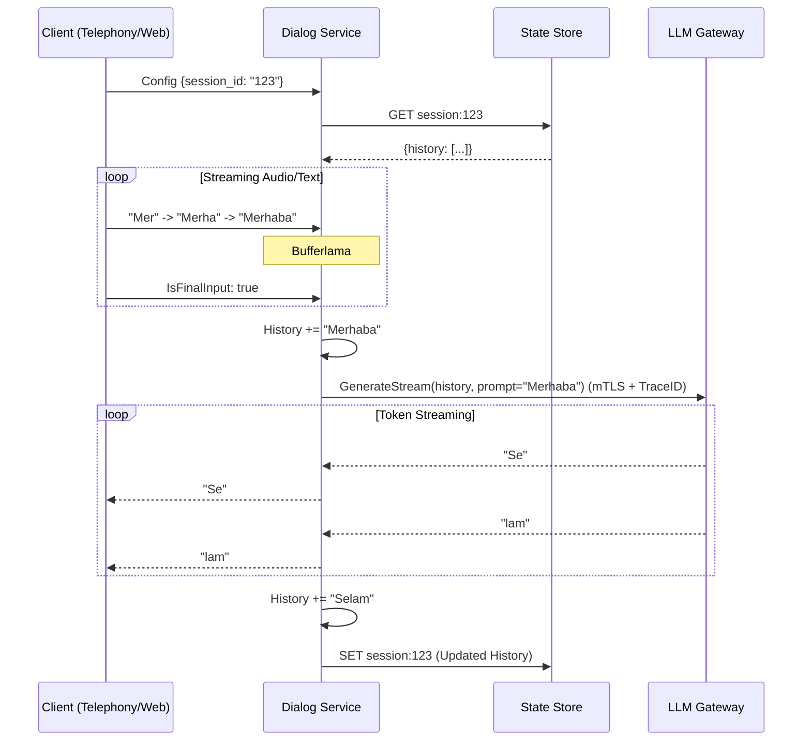

# 🧠 Mantık Mimarisi

## 1. Akış Diyagramı (Streaming Loop)

`StreamConversation` RPC metodu şu döngüyü işletir:

## 2. Güvenlik ve Gözlemlenebilirlik

*   **mTLS:** `internal/clients/llm/client.go` içinde Client Certificate yüklenir. Gateway'e bağlanırken bu sertifika sunulur.
*   **Trace ID:** İstek ile gelen `session_id`, `x-trace-id` header'ı olarak LLM Gateway'e ve oradan Llama Service'e kadar taşınır. Bu sayede loglarda `[TraceID: xyz]` takibi yapılabilir.