# 🗺️ Sentiric Dialog Service - Mantık ve Akış Mimarisi

**Stratejik Rol:** Bir çağrı oturumunun (veya kanal oturumunun) tüm diyalog akışını, durumunu ve LLM/Knowledge Service'ten gelen bilgiyi koordine eden durum makinesi yöneticisi.

---

## 1. Temel Akış: Durum Yönetimi ve LLM Etkileşimi

Bu servis, gelen kullanıcı girdisini (STT'den gelen metin) işler, konuşma geçmişini günceller ve LLM'den bir sonraki yanıtı alarak `agent-service`'e geri gönderir.

```mermaid
graph TD
    A[Agent Service] -- gRPC: ProcessUserInput(text, context) --> B(Dialog Service)
    
    B --> C{State Management / History Update};
    
    C --> D[LLM / Knowledge Query Service];
    D --> E[LLM Gateway Service];
    
    E -- API: Generate(prompt) --> LLM[Uzman LLM Motoru];
    LLM -- Response --> E;
    
    E --> B;
    
    Note over B: Karar verir (Play Audio, Transfer, Terminate)
    B -- gRPC: DialogResponse(audio_uri, next_action) --> A;
```

## 2. Durum Makinesi (Basitleştirilmiş)

```mermaid
stateDiagram-v2
    direction LR
    Unidentified: Kullanıcı kimliği belirlenmemiş
    Welcome: Karşılama anonsu bekleniyor
    Listening: Kullanıcı girdisi bekleniyor
    Processing: LLM/RAG sorgulanıyor
    Completed: Görev tamamlandı
    Terminated: Çağrı sonlandırıldı

    [*] --> Unidentified : Yeni Çağrı
    Unidentified --> Welcome : User Identified
    Welcome --> Listening : PlayAudio Complete
    Listening --> Processing : User Input Received (Speech)
    Processing --> Listening : LLM Response (Ask again)
    Processing --> Completed : LLM Response (Success)
    Completed --> Terminated : Action: TERMINATE_CALL
    Listening --> Terminated : Action: TERMINATE_CALL / Max Failures
```

